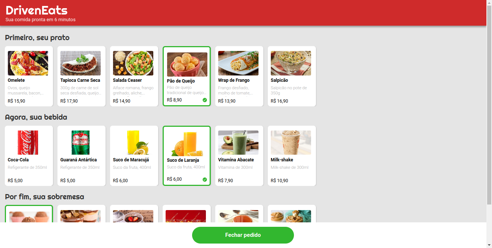
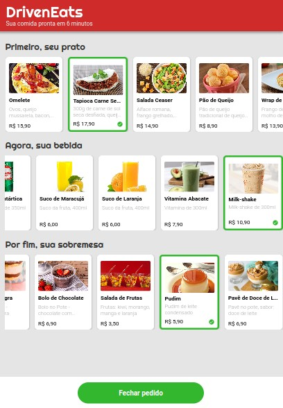
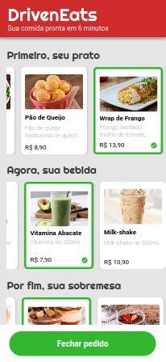
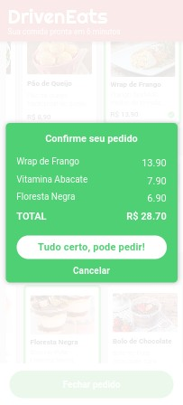
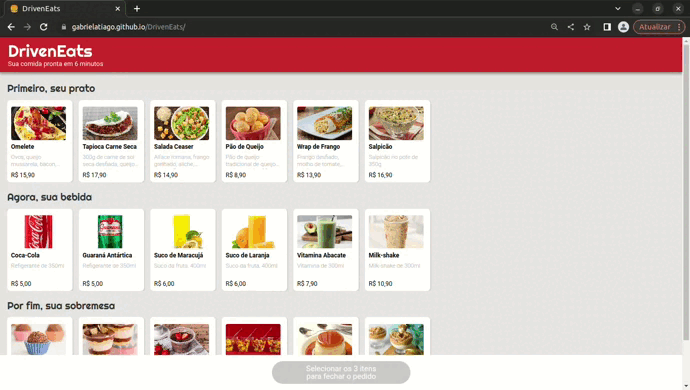

# 
DrivenEats

### 
Aplicativo de Delivery

   
   
    
   

### :clipboard: Descrição

DrivenEats, um restaurante especial que entrega seu pedido em 6 minutos.

Para isso, o restaurante só trabalha com um tipo específico de pedido: o combo de Prato+Bebida+Sobremesa.

O site permite de forma fácil a escolha do seu combo, enviando em seguida o pedido por WhatsApp diretamente para o restaurante.

#### 🍔 [Acesse aqui](https://gabrielatiago.github.io/DrivenEats/)

---

### :computer: Telas

##### Desktop:

##### Tablet:

##### Mobile:

    
    

[🔝 De volta ao top](#driveneats) 
